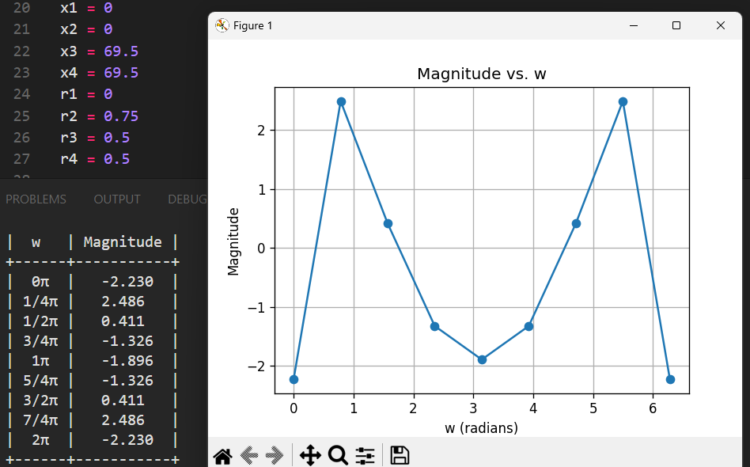
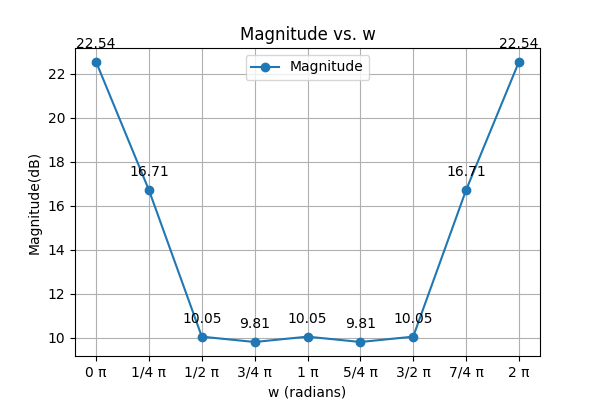
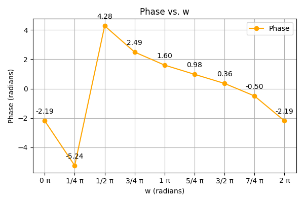

To install the required packages using pip, run the following commands in your terminal or command prompt:
```bash
pip install matplotlib
pip install prettytable
```
<details>
  <summary>Magnitude Response</summary>
  
```
|H(w)| = 10 log (1 + r₁² - 2r₁ cos(w - x₁)) + 
         10 log (1 + r₂² - 2r₂ cos(w + x₂)) -
         10 log (1 + r₃² - 2r₃ cos(w - x₃)) - 
         10 log (1 + r₄² - 2r₄ cos(w + x₄))
```
</details>
</br>
<details>
  <summary>Phase Response</summary>
  
```
phase = tan⁻¹((r₁sin(w-x₁))/(1-r₁cos(w-x₁))) +
        tan⁻¹((r₂sin(w-x₂))/(1-r₂cos(w-x₂))) -
        tan⁻¹((r₃sin(w-x₃))/(1-r₃cos(w-x₃))) -
        tan⁻¹((r₄sin(w-x₄))/(1-r₄cos(w-x₄)))
```
</details>
</br>
<details>
  <summary>Example</summary>
  
```
# Values of magnitude r1, r2, r3, r4 and angles x1, x2, x3, x4 
r1 = 2.14
r2 = 2.14
r3 = 0.477
r4 = 0.477

x1 = 1.29
x2 = 1.29
x3 = 0.34
x4 = 0.34
```

<p align="center">
  
  
  
</p>
</details>


