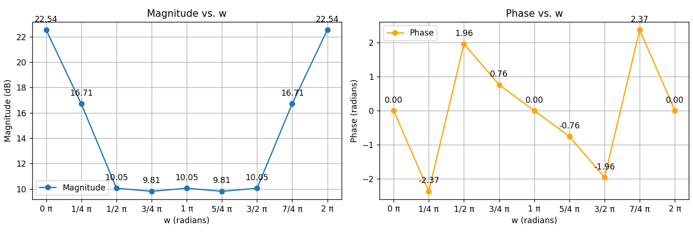

# DSAP Frequency Response

### Installation Instructions

To install the required packages, run the following commands in your terminal or command prompt:

```bash
pip install -r requirements.py
```

### Running the Script

To run the Streamlit application, use the following command:

```bash
streamlit run app.py
```

### Magnitude Response

The magnitude response \(|H(w)|\) is calculated using the formula:

```plaintext
|H(w)| = 10 log (1 + r₁² - 2r₁ cos(w - x₁)) + 
         10 log (1 + r₂² - 2r₂ cos(w + x₂)) -
         10 log (1 + r₃² - 2r₃ cos(w - x₃)) - 
         10 log (1 + r₄² - 2r₄ cos(w + x₄))
```

### Phase Response

The phase response is calculated using the formula:

```plaintext
phase = tan⁻¹((r₁ sin(w - x₁)) / (1 - r₁ cos(w - x₁))) +
        tan⁻¹((r₂ sin(w + x₂)) / (1 - r₂ cos(w + x₂))) -
        tan⁻¹((r₃ sin(w - x₃)) / (1 - r₃ cos(w - x₃))) -
        tan⁻¹((r₄ sin(w + x₄)) / (1 - r₄ cos(w + x₄)))
```

### Example

To change the values for the magnitude and angles, adjust the following parameters in the script:

```python
# Zeroes magnitude and angle
r1 = r2 = 2.14
x1 = x2 = 1.29

# Poles magnitude and angle
r3 = r4 = 0.477
x3 = x4 = 0.34
```

### Visualizations

Below are example plots for the magnitude and phase responses:

<p align="center">
  
  
</p>
